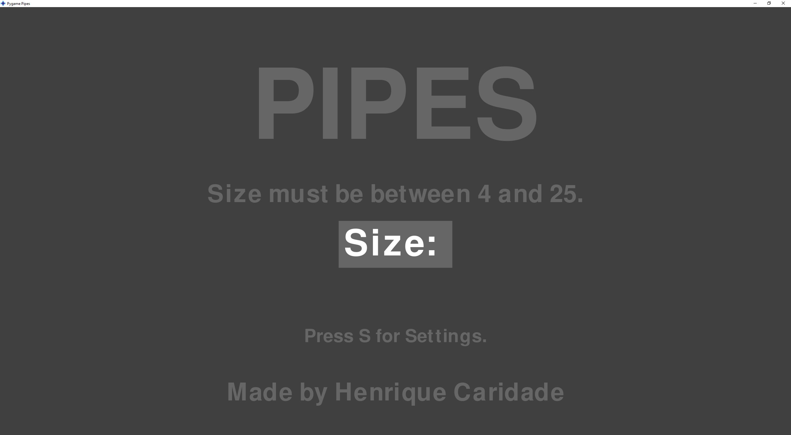
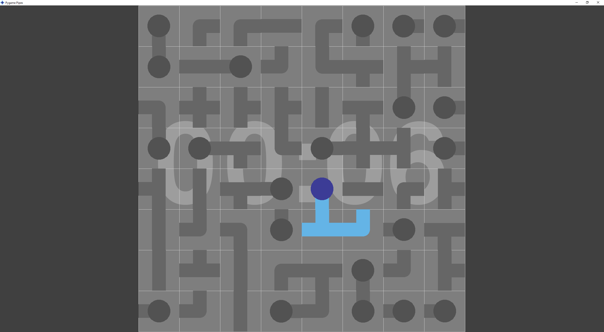
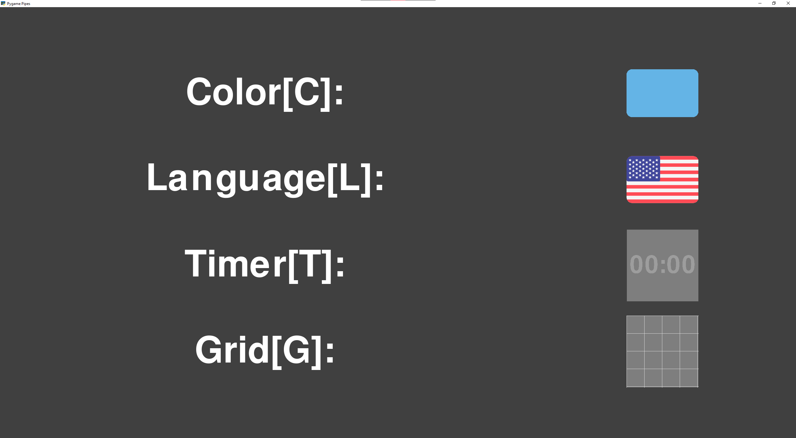

# Projeto pipes-pygame
## FP/L.EIC, 2021/22
## Henrique Caridade (up202108817)
## 1LEIC05

### Objetivo

1. Criar em Pygame o jogo Pipes (https://www.puzzle-pipes.com)...

### Repositório de código

1) Link para o repositório do GitHub: https://github.com/HenriqueFPSC/pipes-pygame

2) Adicionar, como colaborador com permissão de leitura (*role read*):

- https://github.com/AfonsoSalgadoSousa
- https://github.com/jlopes60
- https://github.com/nmacedo
- https://github.com/rpmcruz
- https://github.com/eSoares
- https://github.com/pbv
- https://github.com/imdcode
- https://github.com/acoelho-fe-up-pt

### Descrição

*---É um jogo de puzzle em que o objetivo do jogo é conectar todos os "nodes" recetores á fonte central de água (passando
por todos os tubos). Os "nodes" recetores são conectados á fonte central por tubos que precisam de ser rodados para fazer
as conecções. Para rodar um tubo (ou um "node" recetor ou a fonte central) basta clicar no mesmo (rotação em sentido horário). 
Uma vez que todos os "nodes" recetores estam a receber água da fonte central o jogador ganha e o jogo acaba.---*

### UI

### Pacotes

- Pygame
- Random
- Time
- Typing
- Platform

### Tarefas

1. Calcular uma tubulação possível que preencha a matrix toda n x n
2. Desenhar a matrix do jogo
3. Ler o rato e rodar as peças de acordo
4. Verificar se jogador chegou ao fim do nível

- Atualizado a última vez em 15/12/2021
